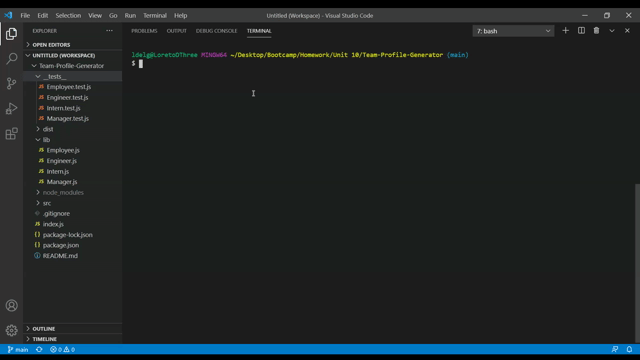

# Team Profile Generator

## Descriptions

This application utilizes user inputs to generate a team of employees and ultimately publishes an html file. When the app is initiated the user is prompted questions about the manger of the team. The user then has the option to add additional employees (an engineer or intern) or finish creating a team. If the later is chosen the a webpage with cards of each member of the team will be displayed.

## Table of Contents

- [Installation](#installation)
- [Usage](#usage)
- [License](#license)
- [Credits](#contributing)
- [Tests](#tests)
- [Questions](#questions)

## Installation

The user must have node installed. The user should also install inquirer.

## Usage

## License

This application is covered by the Creative Commons license.

## Contributing

No collaborators at this time.

## Tests

There are built in tests for this application. If you would like to run these tests please install jest.

## Questions

If you have any questions please send an email to: ldelgadothethird@gmail.com or go to github at: https://github.com/ldelgadoIII
